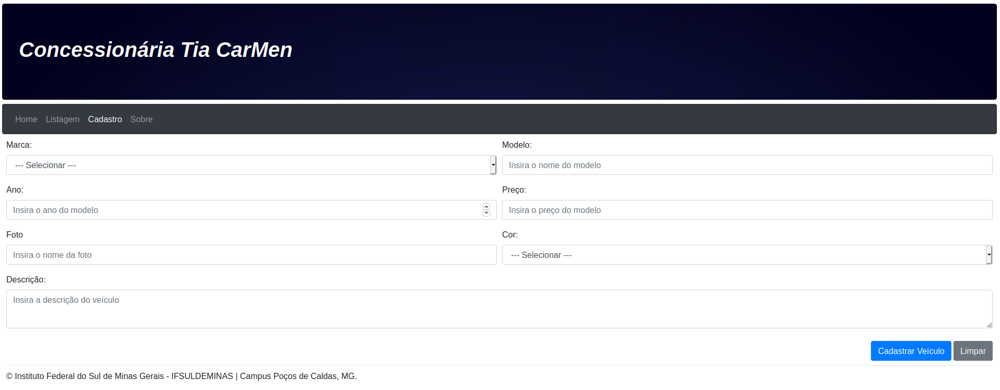

# Projeto de Programação Web de Javascript + Bootstrap

## Descrição
O projeto consiste na confecção do site em HTML de uma concessionária fictícia, utilizando as tecnologias Javascript e Bootstrap. O site é capaz de cadastrar veículos e salvar os dados no WebStorage do navegador e que estiver sendo executado. 

## Execução
Por ser um conjunto de páginas HTML basta abrir a página de sua escolha em seu navegador preferido.

## Páginas

### Home
É uma página de apresentação contendo descrição, horários de funcionamentos e localização da concessíonária (fictícia).

### Listagem
Página onde as informações dos veículos cadastrados são mostradas, carregadas a partir do webStorage do navegador, é possível editá-las ou excluí-las.

### Cadastro
Página onde você pode cadastrar novos veículos na base de dados (webStorage do navegador). Faz a leitura e validação dos dados a serem cadastrados e informa quais cqampos não foram preenchidos corretamente. O nome da imagem deve conter também o formato do arquivo, o arquivo da imagem deve estar contido na pasta `./fotos/`.

### Sobre
Página onde contém as informações dos desenvolvedores do projeto:

* Luiz Gustavo Chinelato Setten
* Pedro Henrique Borges Prado
